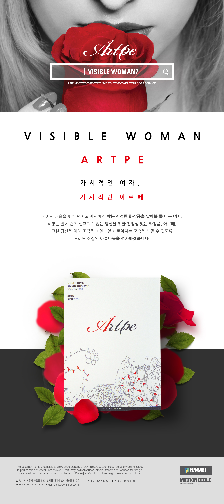
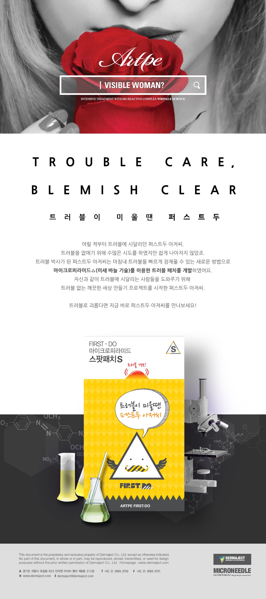

# Resume

이민아 Lee Min Ah

- Web Developer
- Mail : leeimma@naver.com
- github : https://github.com/leeimma
    
 
# 경력
### 에스티에이엠
* 2017.02 ~ 2018.12
    
 
# 회사 프로젝트
## 퍼블리싱
### 아르페 브랜드 퍼블리싱
 - 개발 기간 : 2017.03
 - 담당 업무 : 아르페 몰 홈페이지 퍼블리싱
 
   

### 레오버넷 
    
 
## 안드로이드
### 신세계백화점 워킹마일리지 이벤트 페이지
 - 개발 기간 : 2017.06 ~ 2017.07
 - 담당 업무 : working Mileage - server api 구현 및 연동
 
     

### 마사회 SMS 서비스
    
 
## 웹페이지
### 메가박스 영사 제어

