# Resume

이민아 Lee Min Ah

- Web Developer
- Mail : leeimma@naver.com
- github : https://github.com/leeimma
    
 
# 경력
### 에스티에이엠
* 2017.02 ~ (재직중)

    
# 회사 프로젝트 
## 웹페이지
### STAM 홈페이지
 - 개발 기간 : 2017.02 ~ 2017.03
 - 담당 업무 : 관리자 페이지 
 - 업무 내용 : 다음에디터 적용
 - 개발 기술 : java, javascript, bootstrap, oracle, 우분투, svn
 
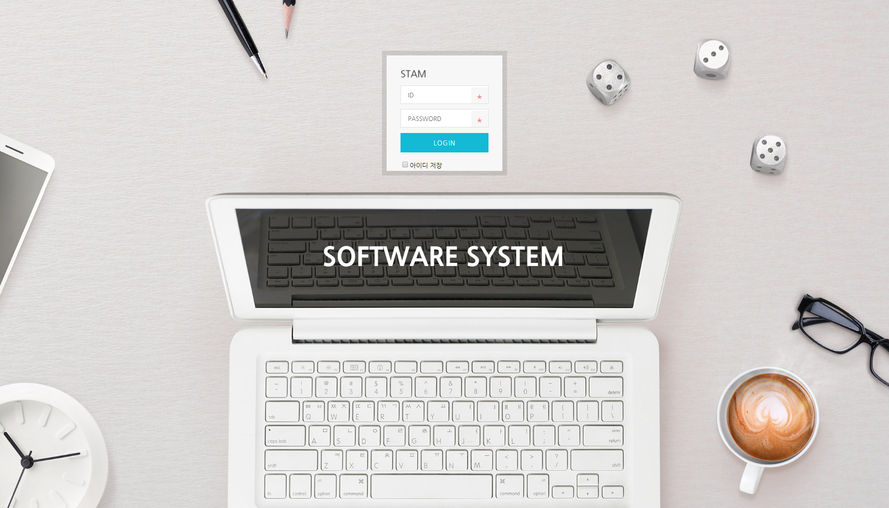 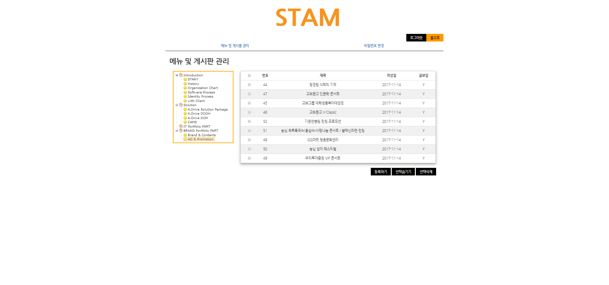 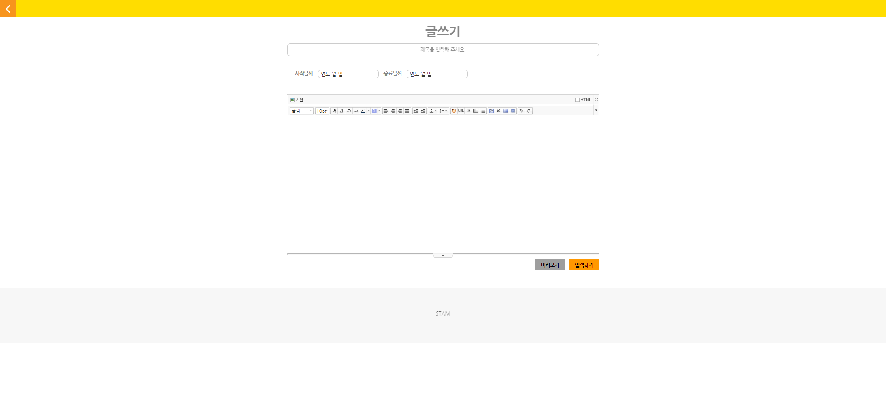
### 메가박스 극장관리시스템
 - 개발 기간 : 2017.03 ~ 
 - 담당 업무 : 메가박스 극장 관리 시스템 고도화 및 유지보수
 - 개발 기술 : java(1.8), javascript, spring(4.3.9.RELEASE), mariadb10.2.7(mysql 마이그레이션), logback(1.0.13), svn
 - 업무 내용 : 
    1. 개발 프로세스 : 자동스케줄 프로세스 정리 및 수정, 이머전시 프로세스 정리 및 수정, shutdown 프로세스 추가, kdm(암호키) 프로세스 수정
    2. 영사 장비 연동 (영사기(sony,nec,barco,christie,gdc), 프로젝터(sony,nec,barco,christie), 오디오프로세서(ap20,cp850)) 및 제어
    3. spring batch 정리 및 
    4. 페이지 추가(램프 필터 발주, 비상연락망, 사운드 제어, 지점 관리 페이지)
    5. 설치/삭제 패키징 생성(nsis 사용)
 

 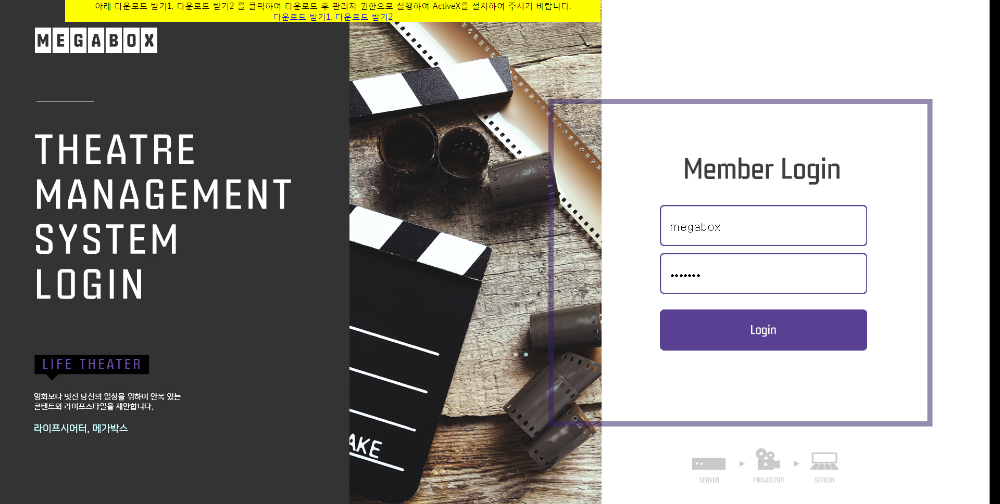 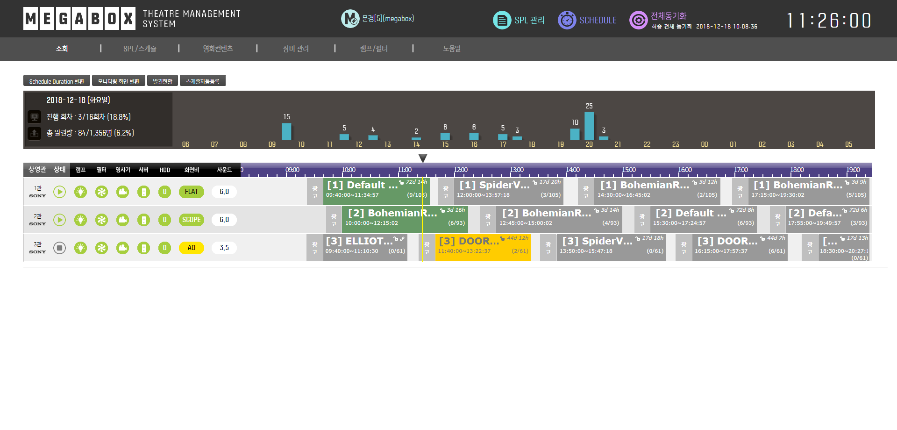 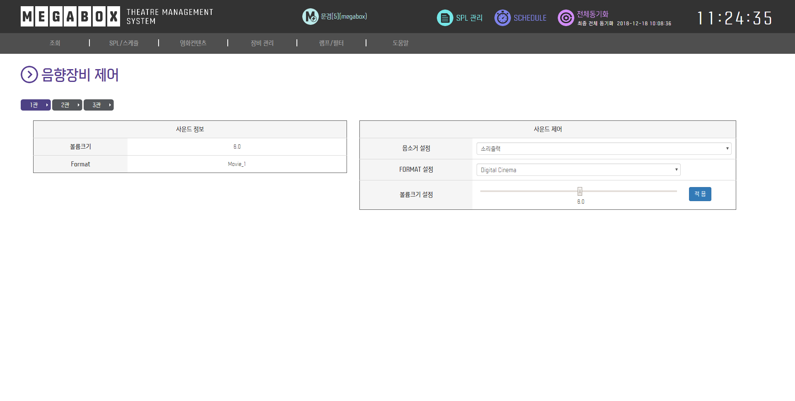 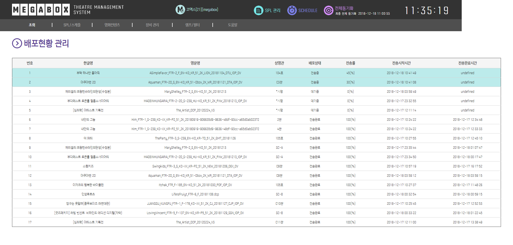 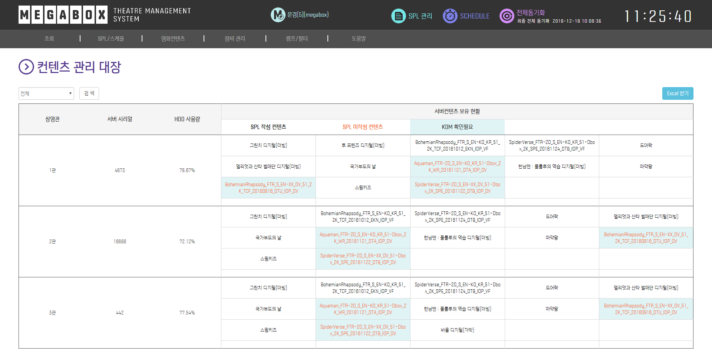 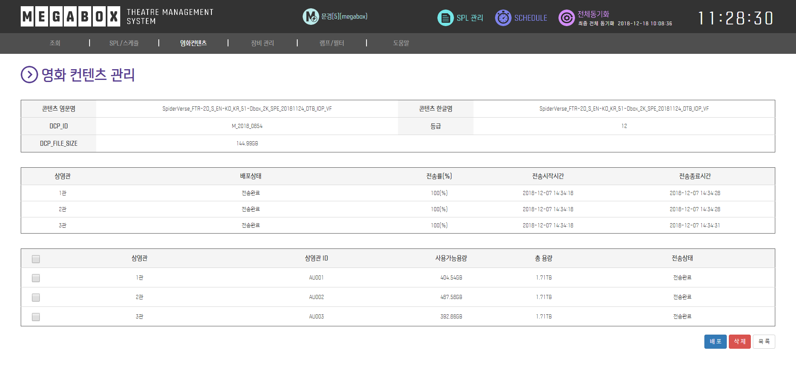 

### 메가박스 영화 NOC
 TMS의 상태 확인 및 관리 가능하며 각 지점의 영사 현황 체크 가능한 시스템
 - 개발 기간 : 2017.08 ~
 - 담당 업무 : 기능 추가 및 유지보수
 - 개발 기술 : java, javascript, 자체 프레임워크, oracle, svn
 - 업무 내용 : 
   1. UI 수정(TMS 및 각 지점의 영사 현황 모니터링 기능 추가, 지점 상세 페이지 수정)
   2. 램프 필터 발주 관리 시스템, 시영 정보, 비상연락망, 공지사항, TMS 버전 배포 등 TMS와 연동 하는 페이지 및 기능 추가
 

  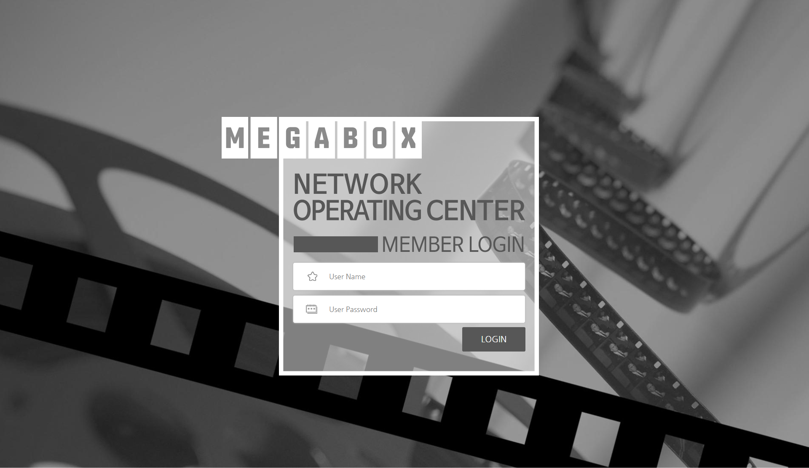 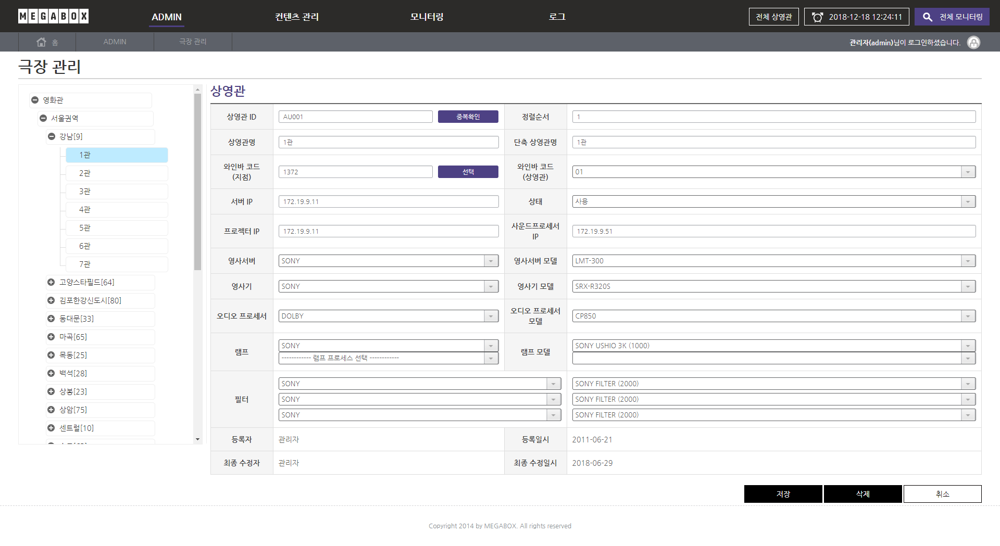 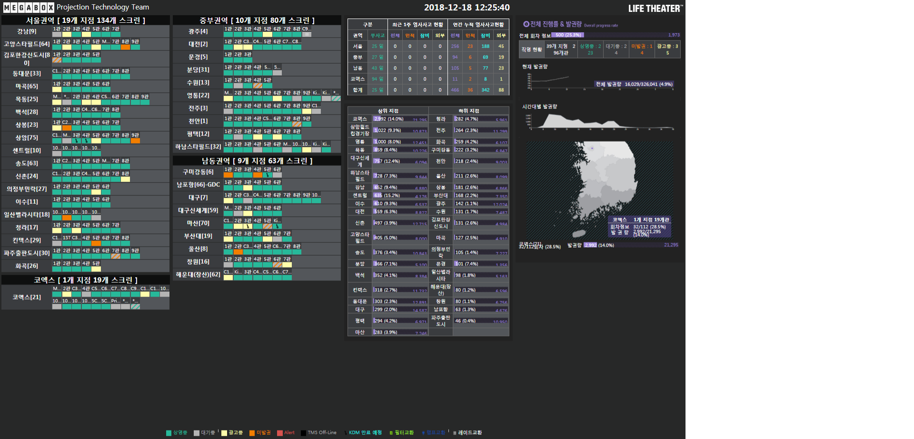 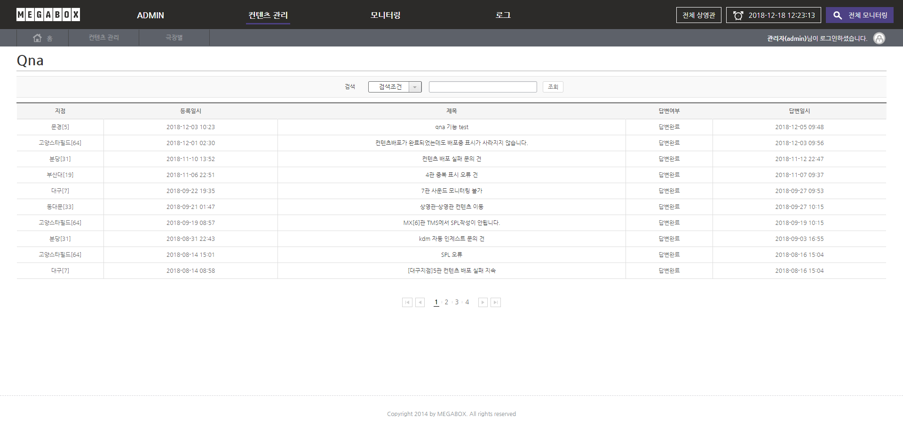 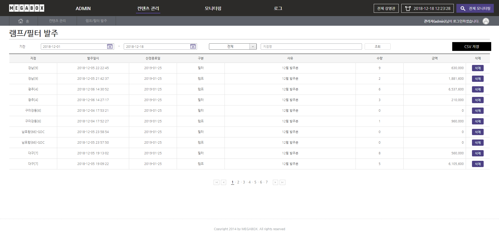 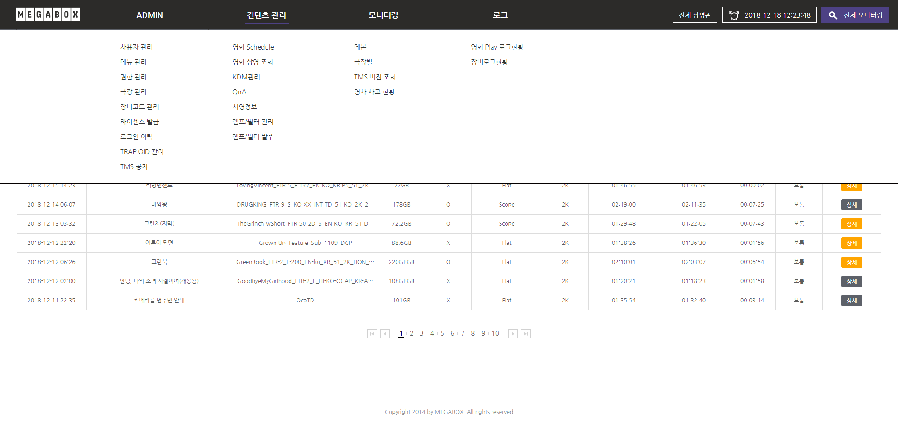 
 
### 삼성 이벤트 페이지(모바일 페이지) 
 - 개발 기간 : 2018.02 ~ 2018.03
 - 담당 업무 : 이벤트 페이지 퍼블리싱 및 개발
 - 업무 내용 : 국가별 퍼블리싱 및 이벤트 로직 개발
 - 개발 기술 : java, javascript, svn 

     
 
   
## 안드로이드
### 신세계백화점 워킹마일리지 이벤트 페이지
 - 개발 기간 : 2017.06 ~ 2017.07
 - 개발 기술 : java, svn
 - 담당 업무 : working Mileage - server api 개발 및 연동
 - 업무 내용 : http 통신으로 xml 형식의 데이터 연동, 사용자 정보, 날짜별 정보 연동
 -  앱 소개 : 사용자 위치기반으로 신세계 백화점에서 걷는만큼 마일리지 적립,특정 마일리지 적립마다 혜택 증정
 
     

 ### 메가박스 모바일 (하이브리드 앱(Hybrid App))
  극장 TMS와 연동하여 각 지점의 영사 상태와 스케줄 모니터링, 비상 알림제공등 관련 업무를 볼 수 있는 시스템
 - 개발 기간 : 2017.06 ~
 - 담당 업무 : 기능 추가 및 유지보수
 - 개발 기술 : java, javascript, springBoot, svn
 - 업무 내용 :
   1. SPRING LOGBACK 추가
   2. TMS를 통해 장비 연동 기능 고도화
   3. TMS 기능 연동 및 페이지 추가
   3. UI 수정

### 마사회 SMS 서비스 
 - 개발 기간 : 2017.07 ~ 2017.08
 - 개발 기술 : java
 - 담당 업무 : 마사회 서버와 안드로이드 연동
 
  

### 비상 홍보 app 
 - 개발 기간 : 2019.08 ~ 2019.09
 - 개발 기술 : html, javascript, cordova, swiper(lib)
 - 담당 업무 : 비상 국정교과서 홍보앱 개발
 - 업무 내용 : 
  1. html을 오프라인 앱으로 구동
  2. 디자인된 내용을 html로 퍼블리싱
  3. pdf를 다른 앱으로 오픈 할수 있도록 개발
  4. 동영상 재생

   
## 퍼블리싱
### <a href="image/artpe/01_main.jpg" target="_blank"> 아르페 브랜드 퍼블리싱 </a>
 - 개발 기간 : 2017.03
 - 개발 기술 : html, javascript, jquery, css, bootstrap
 - 담당 업무 : 아르페 몰 홈페이지 퍼블리싱

### <a href="image/leoburnett/20181123_11st_mobile.jpg" target="_blank"> 레오버넷 </a>
 - 개발 기간 : 2018.08 ~
 - 담당 업무 : 상품 상세페이지 퍼블리싱
 - 개발 기술 : html, javascript, css
 
   
## 보유기술 및 사용가능 라이브러리
- java
- javascript
- jquery
- mysql, mariadb
- oracle
- ajax
- mvc
- Sqlite
- bootstrap
- android
- svn
- SPRING
- MyBatis
