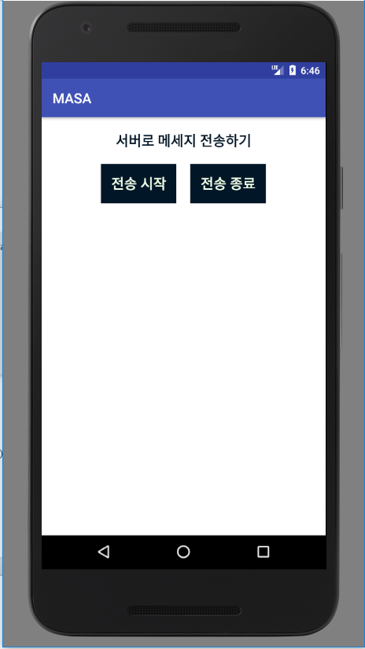
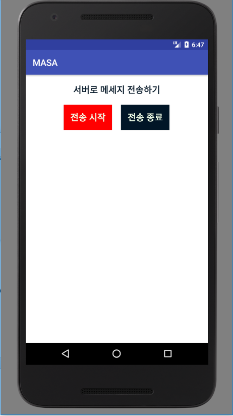
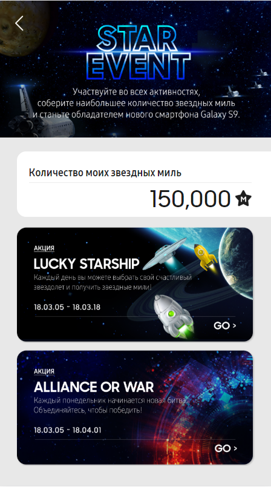
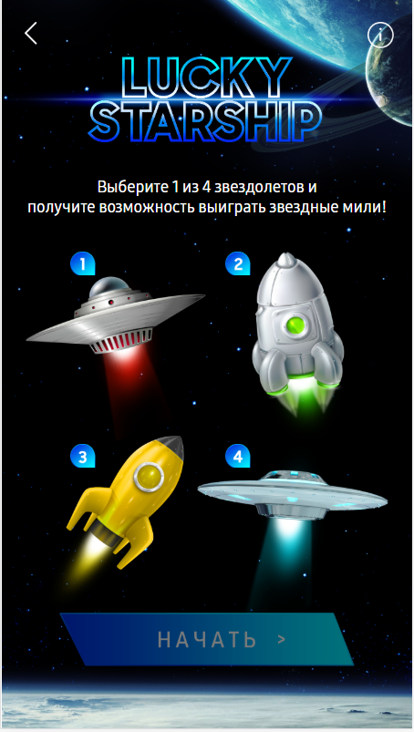
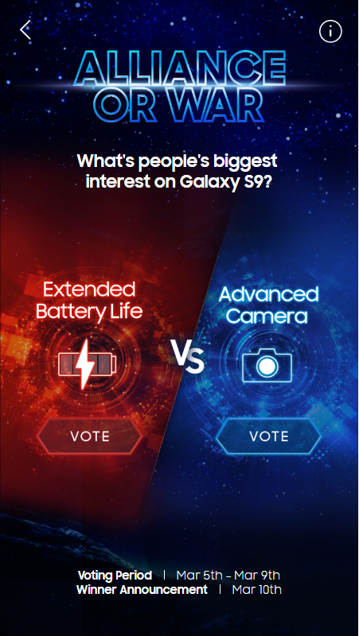
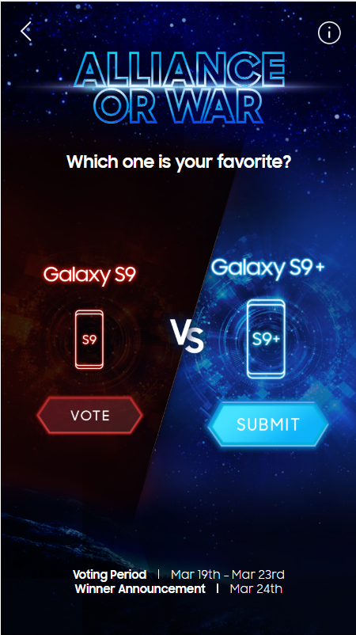
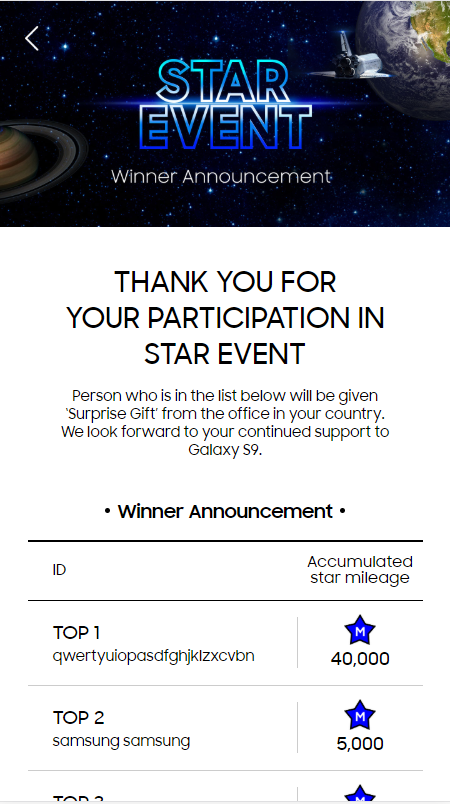

# Resume

이민아 Lee Min Ah

- Web Developer
- Mail : leeimma@naver.com
- github : https://github.com/leeimma
    
 
# 경력
### 에스티에이엠
* 2017.02 ~

    
# 회사 프로젝트 
## 안드로이드
### 신세계백화점 워킹마일리지 이벤트 페이지
 - 개발 기간 : 2017.06 ~ 2017.07
 - 담당 업무 : working Mileage - server api 개발 및 연동
 
     

### 마사회 SMS 서비스 
 - 개발 기간 : 2017.07 ~ 2017.08
 - 담당 업무 : 마사회 서버와 안드로이드 연동
 
  

 ### 메가박스 모바일 (하이브리드 앱(Hybrid App))
 - 개발 기간 : 2017.06 ~
 - 담당 업무 : 기능 추가 및 유지보수
 
    
## 웹페이지
### 메가박스 극장관리시스템
 - 개발 기간 : 2017.03 ~
 - 담당 업무 : 고도화 및 유지보수

### 삼성 이벤트 페이지(모바일 페이지) 
 - 개발 기간 : 2018.02 ~ 2018.03
 - 담당 업무 : 이벤트 페이지 퍼블리싱 및 기능 로직 구현
 
    
 
### 메가박스 영화 NOC (A. Drive DCM)
 - 개발 기간 : 2017.08 ~
 - 담당 업무 : 기능 추가 및 유지보수
 
    
## 퍼블리싱
### <a href="image/artpe/01_main.jpg" target="_blank"> 아르페 브랜드 퍼블리싱 </a>
 - 개발 기간 : 2017.03
 - 담당 업무 : 아르페 몰 홈페이지 퍼블리싱

### <a href="image/leoburnett/20181123_11st_mobile.jpg" target="_blank"> 레오버넷 </a>
 - 개발 기간 : 2018.08 ~
 - 담당 업무 : 상품 상세페이지 퍼블리싱

    
